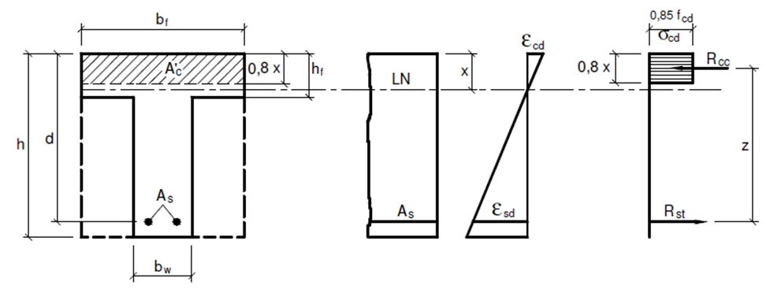

<!--Don't delete this script-->

<!--Don't delete this script-->

<h1>Dimensionamento seções tê</h1>

 

<b>Figura 1.</b> Bla bla bla.

 

<b>Figura 2.</b> Bla bla bla.

 

<b>Figura 3.</b> Bla bla bla.

 

<b>Figura 4.</b> Bla bla bla.

 

A grande questão no <strong>cálculo da seção Tê</strong> é a <strong>definição desta largura de colaboração da mesa ou aba \((ğ‘_𝑓\))</strong>. Essa definição de largura colaborante é complexa e depende de uma série de fatores como por exemplo, tipo de carregamento, tipo e afastamento entre apoios, rigidez da alma e da laje.
  
NBBR 6118 em seu item 14.6.2.2: 

<table border = "0" style = "width:100%">
  <tr>
    <td style="width:90%">\[ b_1 \leq 
          \begin{cases} 
                0,1 \cdot a \\ 
                0,5 \cdot b_2
          \end{cases} \]</td>
    <td style="width:10%">
(1)
</td>
  </tr>
  <tr>
    <td style="width:90%">\[ b_1 \leq 
          \begin{cases} 
                0,1 \cdot a \\ 
                0,5 \cdot b_4
          \end{cases} \]</td>
    <td style="width:10%">
(2)
</td>
  </tr>
</table>

<ol type = "a">
  <li>Viga simplesmente apoiada: \(𝑎 = 1,00 \cdot 𝑙\);</li>
  <li>Tramo com momento em uma só extremidade: \(𝑎 = 0,75 \cdot 𝑙\);</li>
  <li>Tramo com momentos nas duas extremidades: \(𝑎 = 0,60 \cdot 𝑙\);</li>
  <li>Tramo em balanço: \(𝑎 = 2,00 \cdot 𝑙\).</li>
</ol>

 

<b>Figura 5.</b> Bla bla bla.

 

<b>Figura 6.</b> Bla bla bla.

 

<b>Figura 7.</b> Bla bla bla.

 

<table border="0" style="width:100%">
    <tr>
        <td>
            

                
            

        </td>
        <td>
            

                
\(\lambda \cdot x \leq h_f\)

            

        </td>
    </tr>
    <tr>
        <td>
            

                
            

        </td>
        <td>
            

                
\(\lambda \cdot x > h_f\)

            

        </td>
    </tr>
</table>

 

<table border = "0" style = "width:100%">
  <tr>
    <td style="width:90%">\[ M_{1sd} = (b_f - b_w) \cdot h_f \cdot \alpha_c \cdot f_{cd} \cdot (d - 0,5 \cdot h_f) \]</td>
    <td style="width:10%">
(3)
</td>
  </tr>
  <tr>
    <td style="width:90%">\[ M_{2sd} = M_{sd} - M_{1sd} \]</td>
    <td style="width:10%">
(4)
</td>
  </tr>
</table>

 

<b>Figura 13.</b> Bla bla bla.

 

<table border = "0" style = "width:100%">
  <tr>
    <td style="width:90%">\[ A_{1st} = \frac{M_{1sd}}{f_{yd} \cdot (d - 0,5 \cdot h_f)} \]</td>
    <td style="width:10%">
(5)
</td>
  </tr>
  <tr>
    <td style="width:90%">\[ A_{st} = A_{1st} + A_{2st} \]</td>
    <td style="width:10%">
(6)
</td>
  </tr>
</table>

Onde:

<ul>
    <li>\(A_{1st}\): Parcela de aço que advém da contribuição da mesa;</li>
    <li>\(A_{2st}\): Parcela de aço que advém da contribuição da nervura.</li>
</ul>