<h2>Introdução a análise estrutural</h2>

<!--Don't delete this script-->

<!--Don't delete this script-->

{: .important-title }
> O que é modelo estrutural?
>
> Trata-se de um protótipo que procura simular um edifício real no computador [1]. A Figura 1 apresenta a prototipagem computacional de um edifício de múltiplos pavimentos.

<table border = "0" style = "width:100%">
  <tr>
    <td>
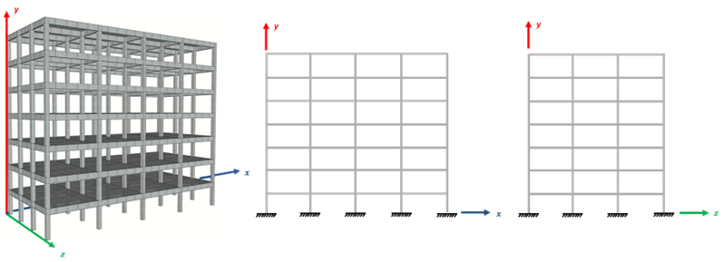
</td>
  </tr>
  <tr>
    <td colspan="2">

<b>Figura 1.</b> Edifício real <i>versus</i> edifício simulado.

</td>
  </tr>
</table>

  Alguns exemplos de modelos podem ser estabelecidos, vejamos a <a href="#fig2">Figura 2</a>:

<table border = "0" style = "width:100%">
  <tr>
    <td>
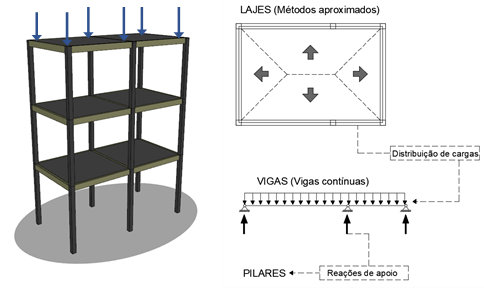
</td>
    <td>
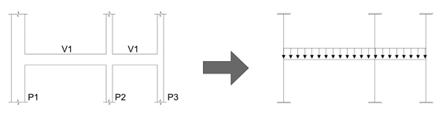
</td>
  </tr>
  <tr>
    <td>

(a) Modelo de viga contínua + lajes por métodos aproximados.

</td>
    <td>

(b) Pórtico H + Pilares.

</td>
  </tr>
  <tr>
    <td>
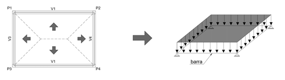
</td>
    <td>
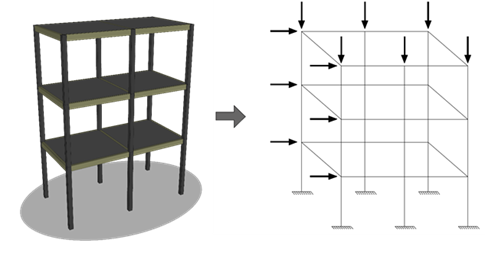
</td>
  </tr>
  <tr>
    <td>

(c) Grelha somente de vigas.

</td>
    <td>

(d) Pórtico espacial ou tridimensional.

</td>
  </tr>
  <tr>
    <td colspan="2">

<b>Figura 2.</b> Exemplo de modelos estruturais <a href="#ref1">[1]</a>.

</td>
  </tr>
</table>

  Sobre a ótica do tipo de análise estrutural, são duas as perspectivas possíveis para avaliação dos esforços em uma estrutura, são elas: (a) a análise linear; ou (b) a análise não linear. A análise não linear normalmente é dividida em três sub grupos, que incluem no problema complexidades que aproximam o modelo do fenômeno natural que deseja representar. O três sub grupos são divididos:

<ul>
    <li>Análise não linear com fonte geométrica;</li>
    <li>Análise não linear com fonte de contato;</li>
    <li>Análise não linear com fonte física.</li>
</ul>

  Vejamos o exemplo da análise não linear geométrica na <a href="#fig3">Figura 3</a>:

<table border = "0" style = "width:100%">
  <tr>
    <td>
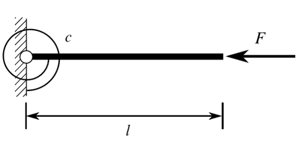
</td>
    <td>
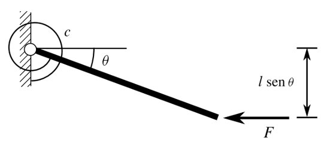
</td>
  </tr>
  <tr>
    <td>

(a) Estrutura indeformada sobre ação da carga F.

</td>
    <td>

(b) Estrutura deformada sobre ação da carga F.

</td>
  </tr>
  <tr>
    <td colspan="2">

<b>Figura 3.</b> Comportamento de uma barra de 1 grau de liberdade (<i>gdl</i>) submetida a uma carga de compressão F.

</td>
  </tr>
</table>

  Agora um exemplo da análise não linear de contato na <a href="#fig4">Figura 4</a>:

<table border = "0" style = "width:100%">
  <tr>
    <td>
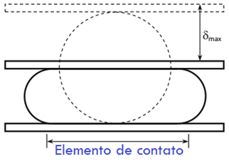
</td>
    <td>
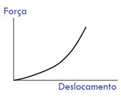
</td>
  </tr>
  <tr>
    <td>

(a) Placa rígida aplicada sobre um cilindro de borracha.

</td>
    <td>

(b) Relação carga versus deslocamento para o problema.

</td>
  </tr>
  <tr>
    <td colspan="2">

<b>Figura 4.</b> Comportamento não linear das condições de contorno.

</td>
  </tr>
</table>

  Vejamos também um exemplo de análise não linear física na <a href="#fig5">Figura 5</a>:

<table border = "0" style = "width:100%">
  <tr>
    <td>
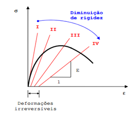
</td>
  </tr>
  <tr>
    <td>

<b>Figura 5.</b> Comportamento não linear físico do concreto devido aop processo de fissuração.

</td>
  </tr>
</table>

  Do ponto de vista do projeto estrutural de edificações usuais de concreto armado temos dois tipos usuais de aplicações: (a) a não linearidade física; e (b) a não linearidade geométrica. Porém aplicaremos essas condições em casos específicos que serão listados aqui. Para isso utilizaremos informações do item <b>14.5.2</b> da <a href="#ref2">ABNT NBR 6118 [2]</a>. Admitiremos em nossas análises o aspecto do cálculo de esforços lineares com as seguintes ponderações:

<ol>
    <li>
Na análise global, as características geométricas podem ser determinadas pela seção bruta de concreto dos elementos estruturais. Em análises locais para cálculo dos deslocamentos, na eventualidade da fissuração, esta deve ser considerada.
</li>
    <li>
Os valores para o módulo de elasticidade e o coeficiente de Poisson devem ser adotados de acordo com o apresentado em 8.2.8 e 8.2.9, devendo, em princípio, ser considerado o módulo de elasticidade secante Ecs.
</li>
    <li>
Os resultados de uma análise linear são usualmente empregados para a verificação de estados- limites de serviço.
</li>
    <li>
Os esforços solicitantes decorrentes de uma análise linear podem servir de base para o dimensiona- mento dos elementos estruturais no estado-limite último, mesmo que esse dimensionamento admita a plastificação dos materiais, desde que se garanta uma dutilidade mínima às peças.
</li>
</ol>

  De forma a considerar a análise não linear física no processo de cálculo vamos empregar os critérios do <i>software</i> TQS conforme descrito na <a href="#fig6">Figura 6</a>.

<table border = "0" style = "width:100%">
  <tr>
    <td>
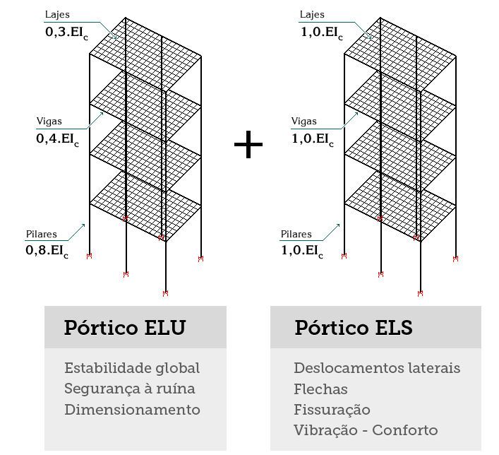
</td>
  </tr>
  <tr>
    <td colspan="2">

<b>Figura 6.</b> Considerações de não linearidade física na avaliação dos esforços <a href="#fig6">[3]</a>.

</td>
  </tr>
</table>

  A não linearidade geométrica normalmente é aplicada quando desejamos avaliar elementos que tem sua geometria altera significativamente pelos esforços, no nosso caso os pilares. Para isso classificaremos as estruturas em: (a) nós móveis e (b) nós fixos. 
    
  Uma estrutura será considerada, de nós fixos, quando os deslocamentos horizontais dos nós são pequenos e, por decorrência, os efeitos gerados são desprezíveis (inferiores a 10 % dos respectivos esforços da análise com geometria fixa) <a href="#ref2">[2]</a>.
    
  Já as estruturas de nós móveis são aquelas onde os deslocamentos horizontais não são pequenos e, em decorrência, os efeitos gerados são importantes (superiores a 10 % dos respectivos esforços iniciais). 

{: .important}
> Os esforços gerados por uma análise linear considerando a geometria fixa é denominado como esforço de 1º ordem. Já a situação onde os deslocamentos horizontais são importantes e geram mudanças significativas nos esforços é denominada como esforço de 2º ordem. Normalmente esforços de 2º ordem estão associados a ações que geram o tombamento da estrutura como por exemplo o vento o desaprumo.

  A consideração dos efeitos ditos de 2º ordem será realizada por meios de procedimentos numéricos e com o cálculo da variável \(\gamma _z\). Tal variável avalia a importância desses efeitos de segunda ordem e então caso eles sejam significativos os esforços da estrutura devem ser majorados pelo valor de \(0,95 \cdot \gamma _z\).

<h2>Pórtico e o subsistema horizontal de lajes</h2>

  Os <i>softwares</i> mais modernos empregados na atualidade permitem a modelagem tridimensional de uma estrutural. Logo dentro de uma perspectiva de aplicação o modelo hoje dito como ideal é o modelo tridimensional com representação da laje como elemento de grelha. A <a href="#fig7">Figura 7</a> apresenta esse modelo que é utilizado pelo <i>software</i> TQS.

<table border = "0" style = "width:100%">
  <tr>
    <td>
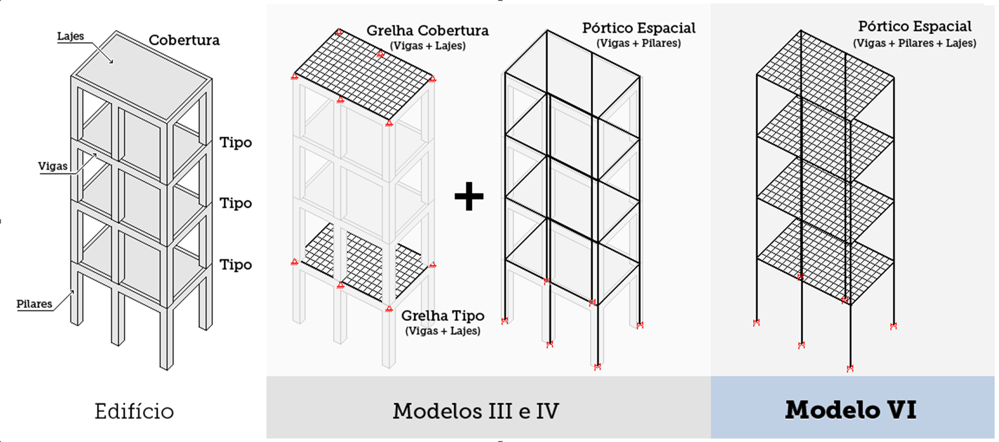
</td>
  </tr>
  <tr>
    <td colspan="2">

<b>Figura 7.</b> Considerações de não linearidade física na avaliação dos esforços <a href="#fig6">[3]</a>.

</td>
  </tr>
</table>

  Neste conteúdo vamos empregar o modelo de pórtico para avaliação dos esforços em pilares e vigas e o modelo tabular para esforços em lajes que é um modelo amplamente aceito para aplicação em estruturas usuais de geometria regular.
    
  Iniciando pelo sub-sistema de lajes obteremos os esforços de flexão via teoria da elasticidade linear e os esforços de cisalhamento via teoria de ruptura, gentilmente conhecido como método do "telhado".
    
  O método de tabelas consiste em considerar a laje como um elemento de placa esbelto (ver <a href="#fig8">Figura 8</a>) e resolver numericamente a equação de equilíbrio de placas fletidas dado conforme <a href="#eq1">equação 1</a>.

<table border = "0" style = "width:100%">
  <tr>
    <td>\[
\frac{\partial^4 w}{\partial x^4} + 2 \frac{\partial^4 w}{\partial x^2 \partial y^2} + \frac{\partial^4 w}{\partial y^4} = \frac{p(x, y)}{D}
\]</td>
    <td>
(1)
</td>
  </tr>
</table>

A <a href="#eq1">equação 1</a> só tem solução analítica para alguns casos particulares como por exemplo em placas circulares. Devido a essa dificuldade de solução formas alternativas foram encontradas para determinar os esforços e deslocamentos em placas com geometrias retangulares com diversas condições de contorno.

<h4>Considerações sobre os apoios</h4>

<h2>Referências</h2>
<table>
    <thead>
        <tr>
            <th>ID</th>
            <th>Descrição</th>
        </tr>
    </thead>
    <tbody>
        <tr>
            <td>
[1]
</td>
            <td>
Kimura A. Informática Aplicada a Estruturas de Concreto Armado. Editora Oficina de Textos; 2ed. 2018.
</td>
        </tr>
        <tr>
            <td>
[2]
</td>
            <td>
Associação Brasileira de Normas Técnicas. ABNT NBR 6118: Projeto de estruturas de concreto – procedimento. Rio de Janeiro (RJ): ABNT; 2023.
</td>
        </tr>
        <tr>
            <td>
[3]
</td>
            <td>
TQS informática. Manual sistemas computacionais engenharia estrutural. 20--.
</td>
        </tr>
    </tbody>
</table>