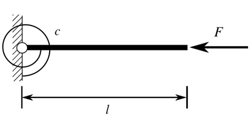
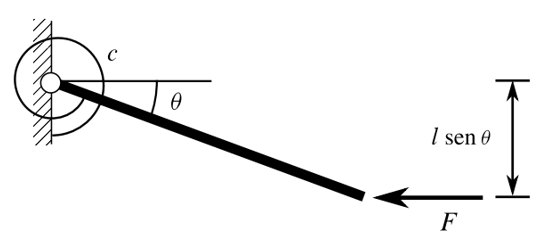
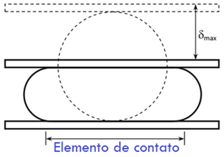
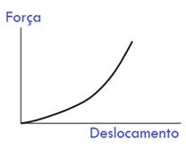
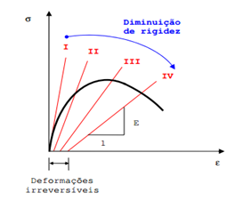
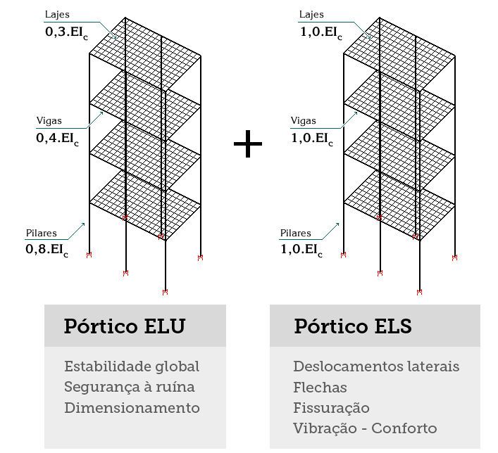

<!--Don't delete this script-->

<!--Don't delete this script-->

<h2>Introdução a análise estrutural</h2> 

  Antes de iniciarmos as explicações relacionadas a análise estrutural devemos estabelecer alguns conceitos de 

  São duas as perspectivas possíveis para análise de esforços em uma estrutura: (a) a análise linear; ou (b) a análise não linear. A análise não linear normalmente é dividida em três sub grupos:

<ul>
    <li>Análise não linear geométrica</li>
    <li>Análise não linear de contato</li>
    <li>Análise não linear física</li>
</ul>

  Vamos ver o exemplo da análise não linear geométrica na <a href="#fig1">Figura 1</a>:

<table border = "0" style = "width:100%">
  <tr>
    <td>

</td>
    <td>

</td>
  </tr>
  <tr>
    <td>

(a) Estrutura indeformada sobre ação da carga F.

</td>
    <td>

(b) Estrutura deformada sobre ação da carga F.

</td>
  </tr>
  <tr>
    <td colspan="2">

<b>Figura 1.</b> Comportamento de uma barra de 1 grau de liberdade (<i>gdl</i>) submetida a uma carga de compressão F.

</td>
  </tr>
</table>

  Agora um exemplo da análise não linear de contato na <a href="#fig2">Figura 2</a>:

<table border = "0" style = "width:100%">
  <tr>
    <td>

</td>
    <td>

</td>
  </tr>
  <tr>
    <td>

(a) Placa rígida aplicada sobre um cilindro de borracha.

</td>
    <td>

(b) Relação carga versus deslocamento para o problema.

</td>
  </tr>
  <tr>
    <td colspan="2">

<b>Figura 2.</b> Comportamento não linear das condições de contorno.

</td>
  </tr>
</table>

  Vejamos também um exemplo de análise não linear física na <a href="#fig3">Figura 3</a>:

<table border = "0" style = "width:100%">
  <tr>
    <td>

</td>
  </tr>
  <tr>
    <td colspan="2">

<b>Figura 3.</b> Comportamento não linear físico do concreto devido aop processo de fissuração.

</td>
  </tr>
</table>

  Do ponto de vista do projeto estrutural de edificações usuais de concreto armado temos dois tipos usuais de aplicações: (a) a não linearidade física; e (b) a não linearidade geométrica. Porém aplicaremos essas condições em casos específicos que serão listados aqui. Para isso utilizaremos informações do item <b>14.5.2</b> da <a href="#ref1">ABNT NBR 6118 [1]</a>. Admitiremos em nossas análises o aspecto do cálculo de esforços lineares com as seguintes ponderações:

<ol>
    <li>
Na análise global, as características geométricas podem ser determinadas pela seção bruta de concreto dos elementos estruturais. Em análises locais para cálculo dos deslocamentos, na eventualidade da fissuração, esta deve ser considerada.
</li>
    <li>
Os valores para o módulo de elasticidade e o coeficiente de Poisson devem ser adotados de acordo com o apresentado em 8.2.8 e 8.2.9, devendo, em princípio, ser considerado o módulo de elasticidade secante Ecs.
</li>
    <li>
Os resultados de uma análise linear são usualmente empregados para a verificação de estados- limites de serviço.
</li>
    <li>
Os esforços solicitantes decorrentes de uma análise linear podem servir de base para o dimensiona- mento dos elementos estruturais no estado-limite último, mesmo que esse dimensionamento admita a plastificação dos materiais, desde que se garanta uma dutilidade mínima às peças.
</li>
</ol>

  De forma a considerar a análise não linear física no processo de cálculo vamos empregar os critérios do <i>software</i> TQS conforme descrito na <a href="#fig4">Figura 4</a>.

<table border = "0" style = "width:100%">
  <tr>
    <td>

</td>
  </tr>
  <tr>
    <td colspan="2">

<b>Figura 4.</b> Considerações de não linearidade física na avaliação dos esforços.

</td>
  </tr>
</table>

  A não linearidade geométrica normalmente é aplicada quando desejamos avaliar elementos que tem sua geometria altera significativamente pelos esforços. Para isso classificaremos as estruturas em: (a) nós móveis e (b) nós fixos. 

<h2>Referências</h2>
<table>
    <thead>
        <tr>
            <th>ID</th>
            <th>Descrição</th>
        </tr>
    </thead>
    <tbody>
        <tr>
            <td>
[1]
</td>
            <td>
Associação Brasileira de Normas Técnicas. ABNT NBR 6118: Projeto de estruturas de concreto – procedimento. Rio de Janeiro (RJ): ABNT; 2023.
</td>
        </tr>
    </tbody>
</table>