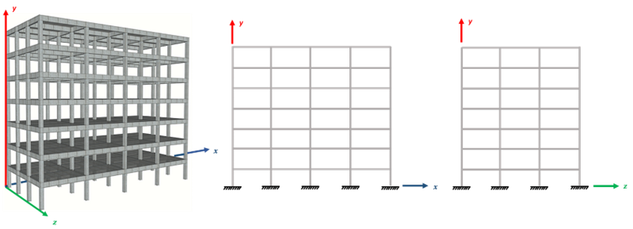
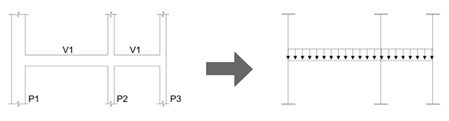
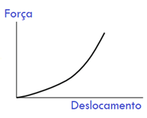
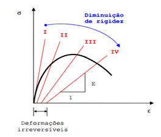
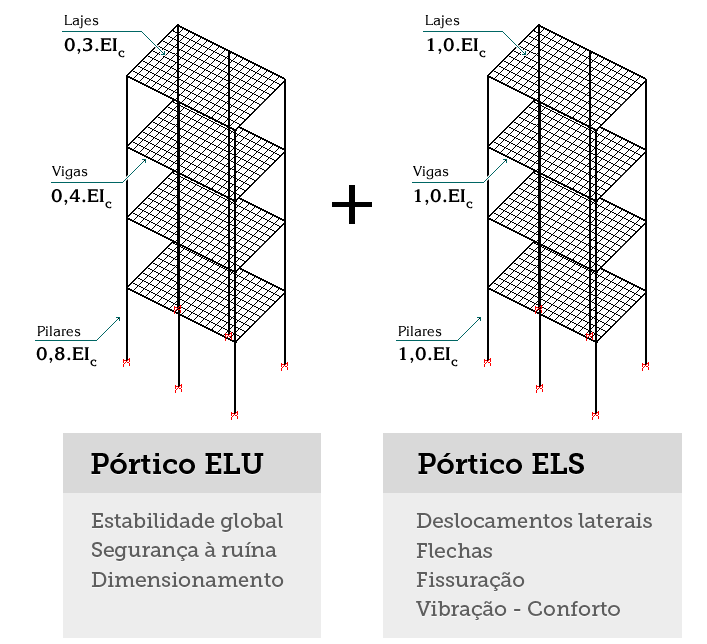

<!--Don't delete this script-->

<!--Don't delete this script-->

<h2>Introdução a análise estrutural</h2>

  O modelo estrutural trata-se de um protótipo que procura <b>simular um edifício real no "computador"</b> (KIMURA, 2018). A Figura 1 apresenta a prototipagem computacional de um edifício de múltiplos pavimentos.

<table border = "0" style = "width:100%">
  <tr>
    <td colspan="2">

<b>Figura 1.</b> Edifício real <i>versus</i> edifício simulado.

</td>
  </tr>
  <tr>
    <td>

</td>
  </tr>
</table>

  Alguns exemplos de modelos podem ser estabelecidos, vejamos a <a href="#fig2">Figura 2</a>:

<table border = "0" style = "width:100%">
  <tr>
    <td colspan="2">

<b>Figura 2.</b> Exemplos de modelo estrutural (KIMURA, 2018).

</td>
  </tr>
  <tr>
    <td>

</td>
    <td>

</td>
  </tr>
  <tr>
    <td>

(a) Modelo de viga contínua + lajes por métodos aproximados.

</td>
    <td>

(b) Pórtico H + Pilares.

</td>
  </tr>
  <tr>
    <td>

</td>
    <td>

</td>
  </tr>
  <tr>
    <td>

(c) Grelha somente de vigas.

</td>
    <td>

(d) Pórtico espacial ou tridimensional.

</td>
  </tr>
</table>

  Sobre a ótica do tipo de <b>análise estrutural</b>, são duas as perspectivas possíveis para avaliação dos esforços em uma estrutura, são elas: (a) a <b>análise linear</b>; ou (b) a <b>análise não linear</b>. A análise não linear normalmente é dividida em três sub grupos, que incluem no problema complexidades que aproximam o modelo idealizado do fenômeno natural, ou real, que deseja-se representar. O três sub grupos são divididos em:

<ul>
    <li>Análise não linear geométrica;</li>
    <li>Análise não linear de contato;</li>
    <li>Análise não linear física.</li>
</ul>

  Vejamos o exemplo da análise não linear geométrica na <a href="#fig3">Figura 3</a>:

<table border = "0" style = "width:100%">
  <tr>
    <td colspan="2">

<b>Figura 3.</b> Comportamento de uma barra de 1 grau de liberdade (<i>gdl</i>) submetida a uma carga de compressão F.

</td>
  </tr>
  <tr>
    <td>

</td>
    <td>

</td>
  </tr>
  <tr>
    <td>

(a) Estrutura indeformada sobre ação da carga F.

</td>
    <td>

(b) Estrutura deformada sobre ação da carga F.

</td>
  </tr>
</table>

  Agora um exemplo da análise não linear de contato na <a href="#fig4">Figura 4</a>:

<table border = "0" style = "width:100%">
  <tr>
    <td colspan="2">

<b>Figura 4.</b> Comportamento não linear das condições de contorno.

</td>
  </tr>
  <tr>
    <td>

</td>
    <td>

</td>
  </tr>
  <tr>
    <td>

(a) Placa rígida aplicada sobre um cilindro de borracha.

</td>
    <td>

(b) Relação carga versus deslocamento para o problema.

</td>
  </tr>

</table>

  Vejamos também um exemplo de análise não linear física na <a href="#fig5">Figura 5</a>:

<table border = "0" style = "width:100%">
  <tr>
    <td>

<b>Figura 5.</b> Comportamento não linear físico do concreto devido aop processo de fissuração.

</td>
  </tr>  
  <tr>
    <td>

</td>
  </tr>
</table>

  Do ponto de vista do projeto estrutural de edificações usuais de concreto armado temos dois tipos usuais de aplicações: (a) a não linearidade física; e (b) a não linearidade geométrica. Porém aplicaremos essas condições em casos específicos que serão listados aqui. Para isso utilizaremos informações do item <b>14.5.2 da ABNT NBR 6118</b>. Admitiremos em nossas análises o aspecto do cálculo de esforços lineares com as seguintes ponderações:

<ol>
    <li>
Na <b>análise global</b>, as características geométricas podem ser determinadas pela <b>seção bruta</b> de concreto dos elementos estruturais. Em <b>análises locais</b> para cálculo dos deslocamentos, na eventualidade da <b>fissuração</b>, esta deve ser <b>considerada</b>.
</li>
    <li>
Os valores para o <b>módulo de elasticidade</b> e o coeficiente de Poisson devem ser adotados de acordo com o apresentado em 8.2.8 e 8.2.9, devendo, em princípio, ser considerado o <b>módulo de elasticidade secante Ecs</b>.
</li>
    <li>
Os resultados de uma <b>análise linear</b> são usualmente empregados para a <b>verificação de estados limites de serviço</b>.
</li>
    <li>
Os esforços solicitantes decorrentes de uma <b>análise linear</b> podem servir de base para o <b>dimensionamento</b> dos elementos estruturais no estado limite último, mesmo que esse dimensionamento admita a plastificação dos materiais, desde que se <b>garanta uma dutilidade mínima às peças</b>.
</li>
</ol>

  De forma a considerar a análise não linear física no processo de cálculo vamos empregar os critérios do <i>software</i> TQS conforme descrito na <a href="#fig6">Figura 6</a>.

<table border = "0" style = "width:100%">
  <tr>
    <td>

<b>Figura 6.</b> Considerações de não linearidade física na avaliação dos esforços (TQS informática, 20--).

</td>
  </tr>
  <tr>
    <td>

</td>
  </tr>

</table>

  A <b>não linearidade geométrica</b> normalmente é aplicada quando desejamos avaliar elementos que tem sua <b>geometria altera significativamente</b> pelos esforços, no nosso caso os <b>pilares</b>. Para isso classificaremos as estruturas em: (a) <b>nós móveis</b> e (b) <b>nós fixos</b>. 
    
  Uma estrutura será considerada, de <b>nós fixos</b>, quando os <b>deslocamentos horizontais dos nós são pequenos</b> e, por decorrência, os efeitos gerados são desprezíveis (inferiores a 10 % dos respectivos esforços da análise com geometria fixa) (ABNT NBR 6118).
    
  Já as estruturas de <b>nós móveis</b> são aquelas onde os <b>deslocamentos horizontais não são pequenos</b> e, em decorrência, os efeitos gerados são importantes (superiores a 10 % dos respectivos esforços iniciais). 

{: .important}
> Os esforços gerados por uma análise linear considerando a geometria fixa é denominado como esforço de 1º ordem. Já a situação onde os deslocamentos horizontais são importantes e geram mudanças significativas nos esforços é denominada como esforço de 2º ordem. Normalmente esforços de 2º ordem estão associados a ações que geram o tombamento da estrutura como por exemplo o vento o desaprumo.

  A consideração dos efeitos ditos de 2º ordem será realizada por meios de procedimentos numéricos e com o cálculo da variável denominada \(\gamma _z\). Tal variável avalia a importância desses efeitos de segunda ordem e então caso eles sejam significativos os esforços da estrutura devem ser majorados pelo valor de \(0,95 \cdot \gamma _z\). Isso será visto com mais detalhes nos esforços dos pilares.

<h2>O modelo estrutural</h2>

  Os <i>softwares</i> mais modernos empregados na atualidade permitem a modelagem tridimensional de uma estrutural. Logo dentro de uma perspectiva de aplicação o modelo hoje dito como ideal é o modelo tridimensional com representação da laje como elemento de grelha. A <a href="#fig7">Figura 7</a> apresenta esse modelo que é utilizado pelo <i>software</i> TQS.

<table border = "0" style = "width:100%">
  <tr>
    <td>

<b>Figura 7.</b> Considerações de não linearidade física na avaliação dos esforços (TQS informática, 20--).

</td>
  </tr>
  <tr>
    <td>

</td>
  </tr>

</table>

  Neste conteúdo vamos empregar o modelo de pórtico para avaliação dos esforços em pilares e vigas e o modelo tabular para esforços em lajes que é um modelo amplamente aceito para aplicação em estruturas usuais de geometria regular.

