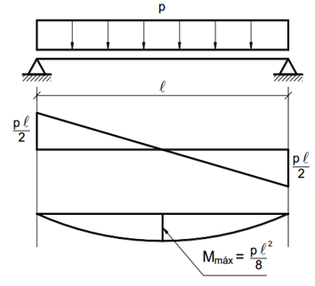
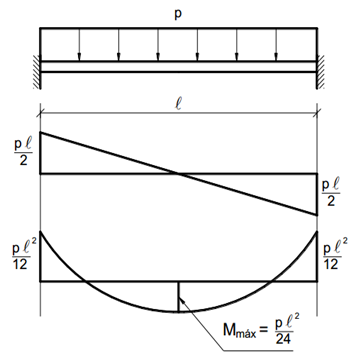

<!--Don't delete this script-->

<!--Don't delete this script-->

  Iniciando pelo subsistema de lajes obteremos os esforços de flexão via teoria da elasticidade linear e os esforços de cisalhamento via teoria de ruptura, gentilmente conhecido como método do "telhado".
    
  O método de tabelas consiste em considerar a laje como um elemento de placa esbelto (ver <a href="#fig1">Figura 1</a>) e resolver numericamente a equação de equilíbrio de placas fletidas dado conforme <a href="#eq1">equação (1)</a>.

<table border = "0" style = "width:100%">
  <tr>
    <td>

<b>Figura 1.</b> Elemento considerado na teoria de placas para construção da <a href="#eq1">equação 1</a> (ARAÚJO, 2014).

</td>
  </tr>
  <tr>
    <td>

</td>
  </tr>
</table>

<table border = "0" style = "width:100%">
  <tr>
    <td style="width:90%">\[
\frac{\partial^4 w}{\partial x^4} + 2 \frac{\partial^4 w}{\partial x^2 \partial y^2} + \frac{\partial^4 w}{\partial y^4} = \frac{p(x, y)}{D}
\]</td>
    <td style="width:10%">
(1)
</td>
  </tr>
</table>

A <a href="#eq1">equação (1)</a> só tem solução analítica para alguns casos particulares como por exemplo em placas circulares. Devido a essa dificuldade de solução formas alternativas foram encontradas para determinar os esforços e deslocamentos em placas com geometrias retangulares com diversas condições de contorno. Com essa situação foi possível construir as famosas tabelas de lajes amplamente empregadas no dia a dia de projetos estruturais.
  
A Tabela empregada neste conteúdo será a <a target="_blank" rel="noopener" href="https://github.com/wmpjrufg/FEA0063/blob/main/assets/files/tabelas/tabela_bares.pdf">de Bares</a>, disponibilizada pelo prof. Pinheiro (2007). As <a target="_blank" rel="noopener" href="https://github.com/wmpjrufg/FEA0063/blob/main/assets/files/tabelas/tabela_bares.pdf">tabelas de Bares</a> serão empregadas quando a relação \(l_y/l_x \leq 2\) é válida, pois para as outras ocasiões adota-se a laje como uma viga com seus respectivos apoios e largura de 1,0 m.
  
Para avaliação dos esforços considerando o modelo placa \(l_y/l_x \leq 2\) aplica-se as equações <a href="#eq2">(2)</a> e <a href="#eq3">(3)</a>, momento fletor e flecha respectivamente. Os fatores das equações podem ser encontrados na <a target="_blank" rel="noopener" href="https://github.com/wmpjrufg/FEA0063/blob/main/assets/files/tabelas/tabela_bares.pdf">tabela de Bares</a>.

<table border = "0" style = "width:100%">
  <tr>
    <td style="width:90%">\[ m = \mu \cdot \frac{p \cdot l_{x}^{2}}{100}\]</td>
    <td style="width:10%">
(2)
</td>
  </tr>
  <tr>
    <td style="width:90%">\[ a = \frac{\alpha}{100} \cdot \frac{b_w}{2} \cdot \frac{p \cdot l_{x}^{4}}{E \cdot I}\]</td>
    <td style="width:10%">
(3)
</td>
  </tr>
</table>

Para avaliações considerando o modelo de viga \(l_y/l_x > 2\) considera-se os esforços da <a href="#fig2">Figura 2</a> (modelo de viga). Já as flechas podem ser consultadas na <a target="_blank" rel="noopener" href="https://github.com/wmpjrufg/FEA0063/blob/main/assets/files/tabelas/tabela_vigas.pdf">tabela de vigas</a> disponibilizada por Pinheiro <i>et al</i> (2010).

<table border = "0" style = "width:100%">
  <tr>
    <td colspan="3">

<b>Figura 2.</b> Momento fletor e cortante em vigas (BASTOS, 2020).

</td>
  </tr>
  <tr>
    <td>

</td>
    <td>

</td>
    <td>

</td>
  </tr>
  <tr>
    <td>

(a) Viga apoiada - apoiada

</td>
    <td>

(b) Viga engastada - apoiada

</td>
    <td>

(b) Viga engastada - engastada

</td>
  </tr>
</table>

O método da ruptura é empregado para determinação das reações conforme descrito no item <b>14.7.6.1</b> da ABNT NBR 6118. Portanto, para lajes maciças retangulares com carga uniforme, podem ser feitas as seguintes aproximações:

<ol>
    <li>
As reações em cada apoio são as correspondentes às cargas atuantes nos triângulos ou trapézios determinados através das charneiras plásticas correspondentes à análise efetivada com os critérios de 14.7.4 ABNT NBR 6118, sendo que essas reações podem ser, de maneira aproximada, consideradas uniformemente distribuídas sobre os elementos estruturais que lhes servem de apoio;
</li>
    <li>
Quando a análise plástica não for efetuada, as charneiras podem ser aproximadas por retas inclinadas, a partir dos vértices, com os seguintes ângulos: (a) 45° entre dois apoios do mesmo tipo; (b) 60° a partir do apoio considerado engastado, se o outro for considerado simplesmente apoiado; e (c) 90° a partir do apoio, quando a borda vizinha for livre.
</li>
</ol>

Alguns exemplos da distribuição de cargas podem ser vistos na <a href="#fig3">Figura 3</a>.

<table border = "0" style = "width:100%">
  <tr>
    <td colspan="2">

<b>Figura 3.</b> Exemplificação de uso do método de charneiras plásticas (PINHEIRO, 2007).

</td>
  </tr>
  <tr>
    <td>

</td>
  </tr>
</table>

<h4>Considerações sobre os apoios</h4>

A escolha desses apoios pode seguir uma série de critérios práticos que permitem sua seleção, são eles (CAMPOS FILHO 2014, BASTOS, 2020):

<ol>
    <li>
Engaste perfeito: Considerado em elementos de laje em balanço como marquises, varandas, etc. É usado também nas bordas onde há continuidade entre duas lajes vizinhas de dimensões e rigidez semelhantes (ver <a href="#fig4">Figura4a</a>);
</li>
    <li>
Sobre a continuidade das lajes com espessuras diferentes é possível definir uma condição de engastamento conforme <a href="#fig4">Figura4b</a>;
</li>
    <li>
Toda a laje que tiver um lado adjacente a uma laje rebaixada tem este lado apoiado; toda a laje rebaixada deve ser considerada apoiada, salvo condições em que se tiver outros três lados livres (ver <a href="#fig4">Figura4c</a>);
</li>
    <li>
No caso onde as lajes não têm continuidade ao longo de toda a borda comum, o critério simplificado para se considerar a vinculação é apresentado <a href="#fig4">Figura4c</a> e equações <a href="#eq2">2</a> e <a href="#eq3">3</a>;
</li>
    <li>
Quando em um lado da laje ocorrerem duas situações de vínculo (apoiado e engastado), a favor da segurança considera-se todo o lado apoiado; se o engaste for superior a 85% do comprimento do lado, pode-se considerar como engastado .
</li>
</ol>

<table border = "0" style = "width:100%">
  <tr>
    <td colspan="2">

<b>Figura 4.</b> Condições de engastamento para lajes.

</td>
  </tr>
  <tr>
    <td>

</td>
    <td>

</td>
  </tr>
  <tr>
    <td>

(a)

</td>
    <td>

(b)

</td>
  </tr>
  <tr>
    <td>

</td>
    <td>

</td>
  </tr>
  <tr>
    <td>

(c)

</td>
    <td>

(d)

</td>
  </tr>
</table>

<h4>Considerações sobre as lajes nervuradas</h4>

A determinação de esforços nas lajes nervuradas bidirecionais pode ser simplificada como lajes maciças. A técnica consiste em transformar a laje nervura bidirecional em formato Tê para uma laje maciça de altura equivalente. A <a href="#fig5">Figura5</a> apresenta a metodologia de transformação na altura equivalente. A <a href="#eq4">equação (4)</a> representa o cálculo da altura equivalente.

<table border = "0" style = "width:100%">
  <tr>
    <td colspan="2">

<b>Figura 5.</b> Equivalência de altura entre lajes nervuradas e maciças.

</td>
  </tr>
  <tr>
    <td>

</td>
  </tr>
</table>

<table border = "0" style = "width:100%">
  <tr>
    <td style="width:90%">\[ h_{eq} = \left( \frac{12 \cdot I }{a+l} \right)^\frac{1}{3} \]</td>
    <td style="width:10%">
(4)
</td>
  </tr>
</table>

Para que o processo de dimensionamento das lajes nervuradas seja feito por nervura tanto reações quanto momentos devem ser corrigidos em função do tamanho da nervura, portanto deve-se utilizar a <a href="#eq5">equação (5)</a>.

<table border = "0" style = "width:100%">
  <tr>
    <td style="width:90%">\[ M_{cor} = M_{tabela} \cdot b_f \]</td>
    <td style="width:10%">
(5)
</td>
  </tr>
</table>