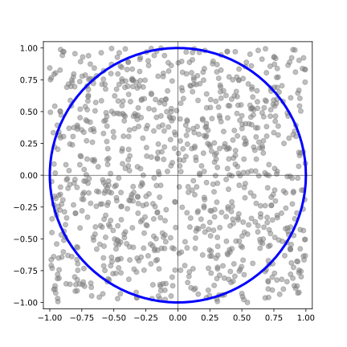

<!--Don't delete this script-->

<!--Don't delete this script-->

This topic explores the Monte Carlo method for estimating the value of \(\pi\) using random numbers. Considering a circle inscribed in a square with a side length of 2, where \(r\) is the circle's radius. \(\pi\) is given by equation <a href="#eq1">(1)</a>.

<table border = "0" style = "width: 100%;">
  <tr>
    <td align = "left" style = "width: 95%;">\[\pi = \frac{A}{r^2}\]</td>
    <td align = "right" style = "width: 5%;">
(1)
</td>
  </tr>
</table>

Using a random concept we can distributed points in the square space. Each point is defined by a pair of coordinates \((x, y)\), where \(x\) and \(y\) are independent random variables uniformly distributed on the interval \([-1, 1]\). The Figure <a href="#fig11">1.1</a> shows this process.

<b>Figure 1.1</b> \(\pi\) problem representation.

To estimate the value of \(\pi\), the number of these random points falling inside the inscribed circle and the number falling outside it are counted. The estimate is given by equation <a href="#eq2">(2)</a> where \(n_{inside}\) represents the number of points inside de circle, and \(n\) is a total of random points.

<table border = "0" style = "width: 100%;">
  <tr>
    <td align = "left" style = "width: 95%;">\[\pi \approx \frac{n_{inside}}{n}\]</td>
    <td align = "right" style = "width: 5%;">
(2)
</td>
  </tr>
</table>

To use Monte Carlo Method assume we have an indicator function \[\mathbf{Y} = g(\mathbf{X})\] which takes the value 1 if it lies in the area
and 0 otherwise. In \(\pi\) problem indicator function is given by equation <a href="#eq4">(4)</a>.

<table border = "0" style = "width: 100%;">
  <tr>
    <td align = "left" style = "width: 95%;">\[ g(\mathbf{X}, \mathbf{Y}) = x^2 + y^2 \]</td>
    <td align = "right" style = "width: 5%;">
(3)
</td>
  </tr>
  <tr>
    <td align = "left" style = "width: 95%;">\[ \mathbf{I} \left[g(\mathbf{X}, \mathbf{Y}) \right] = \left\{\begin{array}{l} 1, \: x^2 + y^2 \leq 1 &\\ 0, \: x^2 + y^2 > 1 \end{array} \right.  \]</td>
    <td align = "right" style = "width: 5%;">
(4)
</td>
  </tr>
</table>

Figure <a href="#fig12">1.2</a> shows four executions of the Monte Carlo method.

<b>Figure 1.2</b> Four executions of the Monte Carlo method.

  <table border = "0" style = "width: 100%;">
    <tr>
      <td style = "width: 50%;">

</td>
      <td style = "width: 50%;">

</td>
    </tr>
    <tr>
      <td align = "center" style = "width: 50%;">\[n = 10^1, \: \pi = xx\]</td>
      <td align = "center" style = "width: 50%;">\[n = 10^2, \: \pi = xx\]</td>
    </tr>
    <tr>
      <td style = "width: 50%;">

</td>
      <td style = "width: 50%;">

</td>
    </tr>
    <tr>
      <td align = "center" style = "width: 50%;">\[n = 10^4, \: \pi = xx\]</td>
      <td align = "center" style = "width: 50%;">\[n = 10^6, \: \pi = xx\]</td>
    </tr>
  </table>

