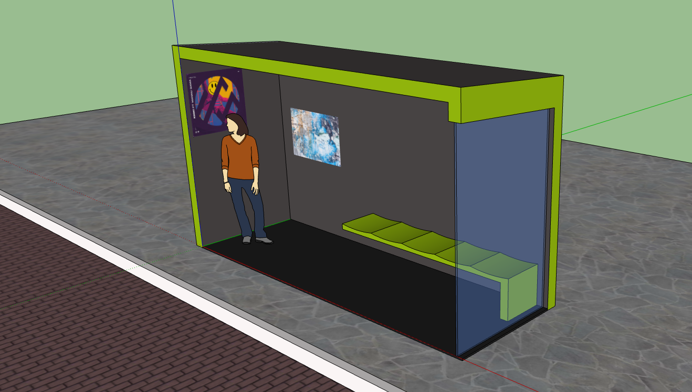
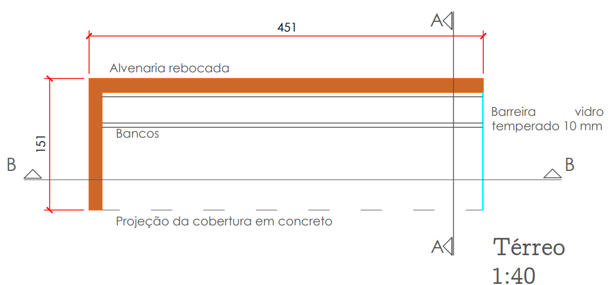
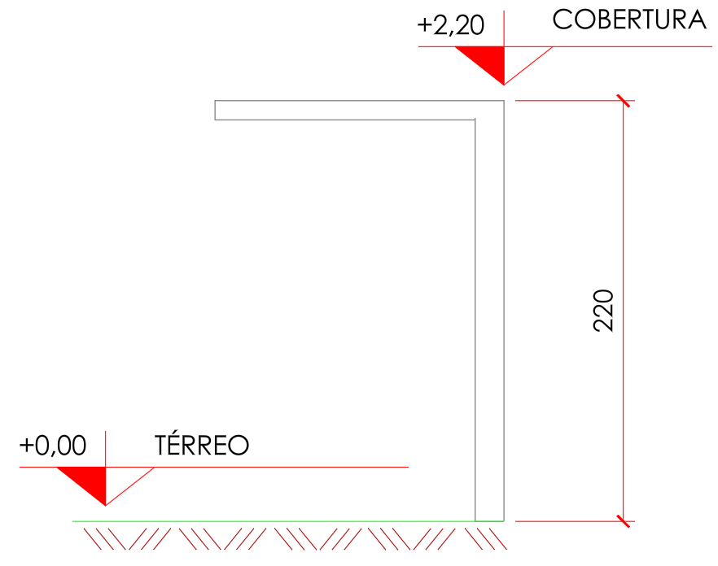

<!--Don't delete this script-->

<!--Don't delete this script-->

  O objetivo desta atividade é projetar um ponto de ônibus em concreto armado que abriga um banco metálico. Em planta baixa o abrigo para pessoas tem 1,51 x 4,51 m. As diretrizes do projeto são as seguintes:

 

<ol>
  <li>
    
<b>Dimensões:</b> O abrigo terá dimensões de 1,51 metros de largura por 4,51 metros de comprimento. Essas dimensões foram cuidadosamente escolhidas para acomodar um número razoável de passageiros com conforto e manter um tamanho adequado para a instalação em locais urbanos.

  </li>
  <li>
    
<b>Estrutura:</b> A estrutura do ponto de ônibus será construída em concreto armado. Essa escolha garantirá a estabilidade e a longevidade da estrutura, suportando as condições climáticas e o uso constante pelos passageiros. No caso a cobertura, pilares, vigas e fundações serão em concreto armado.
 
  </li>
  <li>
    
<b>Cobertura:</b> O abrigo contará com uma cobertura que protegerá os passageiros da chuva e do sol. Essa cobertura será inclinada em no mínimo 5% para evitar o acúmulo de água da chuva e permitir o escoamento adequado. A cobertura deverá ser impermeabilizada com manta asfáltica.

  </li>
  <li> 
    
<b><i>Design</i>:</b> O fechamento lateral será em alvenaria de vedação com blocos de tijolo cerâmico vazado totalizando uma espessura final de 15 cm (fachada esquerda) e o outro fechamento será em vidro temperado de 10 mm (fachada direita). Toda a estrutura será rebocada com uma espessura de argamassa de 0,5 cm em cada face dos elementos.

  </li>
</ol>

O <i>layout</i> do empreendimento é apresentado na <a href="#fig1">Figura 1</a>:

 

<table border = "0" style = "width:100%">
  <tr>
    <td>

</td>
  </tr>
  <tr>
    <td>

<b>Figura 1.</b> Proposta de arquitetura em formato de maquete eletrônica.

</td>
  </tr>
</table>

<h3>Projeto executivo arquitetônico</h3>

 
Os <i>links</i> a seguir apresentam as pranchas de arquitetura e uma visualização 3D do empreendimento em formato de maquete eletrônica.

 

<ul>
  <li><a href="https://github.com/wmpjrufg/FEA0064/blob/gh-pages/files/ARQ_EXE_R00.zip" target="_blank">Arquitetura (AutoCad 2000) e maquete eletrônica (SketchUp)</a></li>
  <li><a href="https://github.com/wmpjrufg/FEA0064/blob/gh-pages/files/ARQ_EXE_R00.zip" target="_blank">Arquitetura (AutoCad 2000) e maquete eletrônica (SketchUp)</a></li>
</ul>

{: .highlight }
> Para abrir a maquete utilize o [SketchUp Educacional](https://edu.sketchup.com/app).

 
As Figuras <a href="#fig2">2</a> e <a href="#fig3">3</a> apresentam imagens da planta baixa do térreo e o corte AA da edificação.

<table border = "0" style = "width:100%">
  <tr>
    <td>

</td>
  </tr>
  <tr>
    <td>

<b>Figura 2.</b> Planta baixa térreo.

</td>
  </tr>
  <tr>
    <td>

</td>
  </tr>
  <tr>
    <td>

<b>Figura 3.</b> Corte AA da edificação.

</td>
  </tr>
</table>
