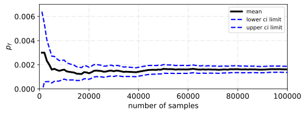

<!--Don't delete ths script-->
<script src = "https://polyfill.io/v3/polyfill.min.js?features=es6"></script>
<script id = "MathJax-script" async src="https://cdn.jsdelivr.net/npm/mathjax@3/es5/tex-mml-chtml.js"></script>
<!--Don't delete ths script-->

<h3>convergence_probability_failure</h3>
<p align = "justify">
    This function calculates the convergence rate of a given column in a data frame. This function is used to check the convergence of the probability of failure or reliability index.
</p>

```python
div, m, ci_l, ci_u = convergence_probability_failure(df, column)
```

Input variables
{: .label .label-yellow }

<table style = "width:100%">
    <thead>
      <tr>
        <th>Name</th>
        <th>Description</th>
        <th>Type</th>
      </tr>
    </thead>
    <tr>
        <td><code>df</code></td>
        <td>DataFrame containing the data with indicator function column</td>
        <td>DataFrame</td>
    </tr>
    <tr>
        <td><code>column</code></td>
        <td>Name of the column to be used for calculating the convergence rate</td>
        <td>String</td>
    </tr>
</table>

Output variables
{: .label .label-yellow }

<table style = "width:100%">
   <thead>
     <tr>
       <th>Name</th>
       <th>Description</th>
       <th>Type</th>
     </tr>
   </thead>
   <tr>
       <td><code>div</code></td>
       <td>List containing sample sizes</td>
       <td>List</td>
   </tr>
   <tr>
       <td><code>m</code></td>
       <td>List containing the mean values of the column. pf value rate</td>
       <td>List</td>
   </tr>
   <tr>
       <td><code>ci_l</code></td>
       <td>List containing the lower confidence interval values of the column</td>
       <td>List</td>
   </tr>
   <tr>
       <td><code>ci_u</code></td>
       <td>List containing the upper confidence interval values of the column</td>
       <td>List</td>
   </tr>
</table>

Example 1
{: .label .label-blue }

<p align = "justify">
    <i>Use <code>convergence_probability_failure</code> function is used to determine the convergence rate of the failure probability of the limit state function I_0.</i>
</p>

```python
# Libraries
import pandas as pd
pd.set_option('display.max_columns', None)

from parepy_toolbox import sampling_algorithm_structural_analysis, convergence_probability_failure
from obj_function import nowak_collins_example

# Check structural reliability 
f = {'type': 'normal', 'loc': 40.3, 'scale': 4.64, 'seed': None}
p = {'type': 'gumbel max', 'loc': 10.2, 'scale': 1.12, 'seed': None}
w = {'type': 'lognormal', 'loc': 0.25, 'scale': 0.025, 'seed': None}
var = [f, p, w]
setup = {
             'number of samples': 100000, 
             'number of dimensions': len(var), 
             'numerical model': {'model sampling': 'mcs'}, 
             'variables settings': var, 
             'number of state limit functions or constraints': 1, 
             'none variable': None,
             'objective function': nowak_collins_example,
             'name simulation': 'nowak_collins_example',
        }
results, pf, beta = sampling_algorithm_structural_analysis(setup)

# Convergence rate
x, m, l, u = convergence_probability_failure(results, 'I_0')
``` 

<p align = "justify">
    We can construct the convergence rate chart using the results <code>m</code>, <code>ci_l</code>, and <code>ci_u</code>. We using <code>x</code> in x-axis.
</p>

<center></center>
<p align = "center"><b>Figure 1.</b> Failure probability - convergence rate.</p>
