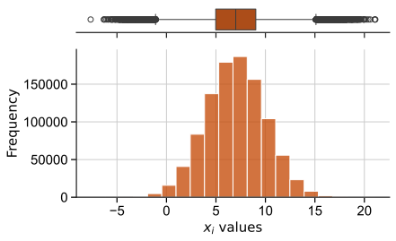
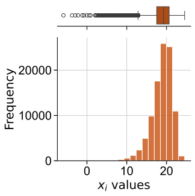
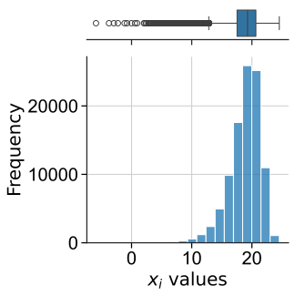
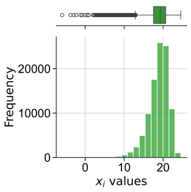
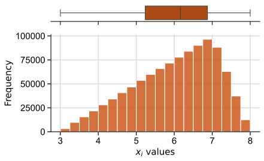

<!--Don't delete ths script-->
<script src = "https://polyfill.io/v3/polyfill.min.js?features=es6"></script>
<script id = "MathJax-script" async src="https://cdn.jsdelivr.net/npm/mathjax@3/es5/tex-mml-chtml.js"></script>
<!--Don't delete ths script-->

<h3>sampling</h3>
<p align = "justify">
    This algorithm generates a set of random numbers according to a type of distribution.
</p>

```python
random_sampling = sampling(n_samples, d, model, variables_setup)
```

Input variables
{: .label .label-yellow }

<table style = "width:100%">
    <thead>
      <tr>
        <th>Name</th>
        <th>Description</th>
        <th>Type</th>
      </tr>
    </thead>
    <tr>
        <td><code>n_samples</code></td>
        <td>Number of samples</td>
        <td>Integer</td>
    </tr>
    <tr>
        <td><code>d</code></td>
        <td>Number of dimensions</td>
        <td>Integer</td>
    </tr>
    <tr>
        <td><code>model</code></td>
        <td>Model parameters. See <a href="#models">models table</a></td>
        <td>Dictionary</td>
    </tr>
    <tr>
        <td><code>variables_setup</code></td>
        <td><p align = "justify">Random variable parameters (list of dictionary format). See <a href="#configs">configs table</a></p></td>
        <td>List</td>
    </tr>
</table>

Output variables
{: .label .label-yellow}

<table style = "width:100%">
   <thead>
     <tr>
       <th>Name</th>
       <th>Description</th>
       <th>Type</th>
     </tr>
   </thead>
   <tr>
       <td><code>random_sampling</code></td>
       <td>Random samples</td>
       <td>Numpy array</td>
   </tr>
</table>

<p align = "justify" id = "models"></p>
<center>
    <p align="center"><b>Table 1.</b> Numerical models (<code>model</code> key).</p>
    <table style = "width:100%">
        <thead>
        <tr>
            <th>Model</th>
            <th>Sintax and describe</th>
            <th>Example</th>
        </tr>
        </thead> 
        <tr>
            <td>Crude Monte Carlo</td>
            <td>
                <ul>
                    <li><code>{'model sampling': put_your_model_here}</code></li>
                    <li><code>'model sampling'</code>: Numerical algorithm used in sampling generator [String]</li>
                </ul>
            </td>
            <td><code>model = {'model sampling': 'mcs'}</code></td>
        </tr>
        <tr>
            <td>Crude Monte Carlo - Stochastic</td>
            <td>
                <ul>
                    <li><code>{'model sampling': put_your_model_here, <br>'time steps': put_your_time_step_here}</code></li>
                    <li><code>'model sampling'</code>: Numerical algorithm used in sampling generator [String]</li>
                    <li><code>'time steps'</code>: Number of time steps used in times series analysis [Integer]</li>
                </ul>
            </td>
            <td><code>model = {'model sampling': 'mcs-time', 'time steps': 5}</code></td>
        </tr>
    </table>
</center>

<p align = "justify" id = "configs"></p>
<center>
    <p align="center"><b>Table 2.</b> Type of pdf and configs (<code>variables_setup</code> key).</p>
    <table style = "width:100%">
        <thead>
        <tr>
            <th>Model</th>
            <th>Sintax and describe</th>
            <th>Example</th>
        </tr>
        </thead> 
        <tr>
            <td>Normal or Gaussian</td>
            <td>
                <ul>
                    <li><code>{'type': put_your_pdf_here, <br>'loc': put_your_mean_here, <br>'scale': put_your_std_here, <br>'seed': put_your_seed_here}</code></li>
                    <li><code>'type'</code>: Type of probability density function [String]</li>
                    <li><code>'loc'</code>: Mean [Float]</li>
                    <li><code>'scale'</code>: Standard deviation [Float]</li>
                    <li><code>'seed'</code>: Random seed. Use <code>None</code> for random seed [Integer or None
                    ]</li>
                    <li><p align="justify"><font color="red">add this key in stochastic case</font> - <code>'stochastic variable'</code>: This variable represents the behavior of the random variable over time intervals. False means the variable with a fixed value in each time interval, and True represents the random behavior of the variable in each time interval. [Boolean]</p></li>
                </ul>            
            </td>
            <td><code>var = {'type': 'normal', 'loc': 40.3, 'scale': 4.64, 'seed': None}</code></td>
        </tr>
        <tr>
            <td>Gumbel Maximum</td>
            <td>
                <ul>
                    <li><code>{'type': put_your_pdf_here, <br>'loc': put_your_mean_here, <br>'scale': put_your_std_here, <br>'seed': put_your_seed_here}</code></li>
                    <li><code>'type'</code>: Type of probability density function [String]</li>
                    <li><code>'loc'</code>: Mean [Float]</li>
                    <li><code>'scale'</code>: Standard deviation [Float]</li>
                    <li><code>'seed'</code>: Random seed. Use <code>None</code> for random seed [Integer or None
                    ]</li>
                    <li><p align="justify"><font color="red">add this key in stochastic case</font> - <code>'stochastic variable'</code>: This variable represents the behavior of the random variable over time intervals. False means the variable with a fixed value in each time interval, and True represents the random behavior of the variable in each time interval. [Boolean]</p></li>
                </ul>            
            </td>
            <td><code>var = {'type': 'gumbel max', 'loc': 40.3, 'scale': 4.64, 'seed': None}</code></td>
        </tr>
        <tr>
            <td>Gumbel Minimum</td>
            <td>
                <ul>
                    <li><code>{'type': put_your_pdf_here, <br>'loc': put_your_mean_here, <br>'scale': put_your_std_here, <br>'seed': put_your_seed_here}</code></li>
                    <li><code>'type'</code>: Type of probability density function [String]</li>
                    <li><code>'loc'</code>: Mean [Float]</li>
                    <li><code>'scale'</code>: Standard deviation [Float]</li>
                    <li><code>'seed'</code>: Random seed. Use <code>None</code> for random seed [Integer or None
                    ]</li>
                    <li><p align="justify"><font color="red">add this key in stochastic case</font> - <code>'stochastic variable'</code>: This variable represents the behavior of the random variable over time intervals. False means the variable with a fixed value in each time interval, and True represents the random behavior of the variable in each time interval. [Boolean]</p></li>
                </ul>            
            </td>
            <td><code>var = {'type': 'gumbel min', 'loc': 40.3, 'scale': 4.64, 'seed': None}</code></td>
        </tr>
        <tr>
            <td>Triangular</td>
            <td>
                <ul>
                    <li><code>{'type': put_your_pdf_here, <br>'loc': put_your_mean_here, <br>'scale': put_your_std_here, <br>'seed': put_your_seed_here}</code></li>
                    <li><code>'type'</code>: Type of probability density function [String]</li>
                    <li><code>'loc'</code>: Mean [Float]</li>
                    <li><code>'scale'</code>: Standard deviation [Float]</li>
                    <li><code>'seed'</code>: Random seed. Use <code>None</code> for random seed [Integer or None
                    ]</li>
                    <li><p align="justify"><font color="red">add this key in stochastic case</font> - <code>'stochastic variable'</code>: This variable represents the behavior of the random variable over time intervals. False means the variable with a fixed value in each time interval, and True represents the random behavior of the variable in each time interval. [Boolean]</p></li>
                </ul>            
            </td>
            <td><code>var = {'type': 'triangular', 'min': 3, 'loc': 7, 'max': 8, 'seed': None}</code></td>
        </tr>
    </table>
</center>

Example 1
{: .label .label-blue }

<p align = "justify">
    <i>In this example, we will use the <code>sampling</code> function to generate a set of random samples \((n=1,000,000)\) following a Normal distribution with mean \(\mu = 7\) and standard deviation \(\sigma = 3\). Use "seed without control" in your setup.</i>
</p>

```python
from parepy_toolbox import sampling

# Dataset
model = {'model sampling': 'mcs'}
f = {'type': 'normal', 'loc': 7, 'scale': 3, 'seed': None}
varSet = [f]
size = 1000000

# Call function
r = sampling(size, len(varSet), model, varSet)

# Output details
print(f'random variables n={len(r)}: \n\n {r} \n\n type variable: {type(r)}')
```

<p align = "justify">
    <i>Output details:</i>
</p>

```bash
random variables n=1000000: 

 [[ 3.5106688 ]
 [ 5.69074161]
 [ 8.60932312]
 ...
 [10.28841779]
 [ 7.25655855]
 [ 7.21348877]] 

 type variable: <class 'numpy.ndarray'>
```

<center>
    
    <p align="center"><b>Figure 1.</b> Random variable example.</p>
</center>

Example 2
{: .label .label-blue }

<p align = "justify">
    <i>In this example, we will use the <code>sampling</code> function to generate a set of random samples \((n=100,000)\) following a Gumbel minimum distribution with mean \(\mu = 20\) and standard deviation \(\sigma = 2\). Use "stochastic variable" in your setup and generate fixed values each time step. Use three time steps.</i>
</p>

```python
from parepy_toolbox import sampling

# Dataset: fixed value in time series
model = {'model sampling': 'mcs-time', 'time steps': 3}
f = {'type': 'gumbel min', 'loc': 20, 'scale': 2, 'seed': None, 'stochastic variable': False}
varSet = [f]
size = 100000

# Call function
r = sampling(size, len(varSet), model, varSet)

# Output details
print(f'random variables n={len(r)}: \n\n {r} \n\n type variable: {type(r)}')
```

<p align = "justify">
    <i>Output details:</i>
</p>

```bash
random variables n=300000: 

[[20.83084403  0.        ]  # --> sample 0 time step = 0
 [20.83084403  1.        ]  # --> sample 0 time step = 1
 [20.83084403  2.        ]  # --> sample 0 time step = 2
 [21.21614749  0.        ]  # --> sample 1 time step = 0
 [21.21614749  1.        ]  # --> sample 1 time step = 1
 [21.21614749  2.        ]  # --> sample 1 time step = 2
 [19.06481753  0.        ]  # --> sample 2 time step = 0
 [19.06481753  1.        ]  # --> sample 2 time step = 1
 [19.06481753  2.        ]  # --> sample 2 time step = 2
 ...
 [18.55312079  0.        ]  # --> sample 299000 time step = 0
 [18.55312079  1.        ]  # --> sample 299000 time step = 1
 [18.55312079  2.        ]] # --> sample 299000 time step = 2

type variable: <class 'numpy.ndarray'>
```
<center>
<table style = "width:100%">
    <tr>
        <td></td>
        <td></td>
        <td></td>
    </tr>
    <tr>
        <td><center>(a) time step id=0 (100,000 values)</center></td>
        <td><center>(b) time step id=1 (100,000 values)</center></td>
        <td><center>(c) time step id=2 (100,000 values)</center></td>
    </tr>
</table>
<p align="center"><b>Figure 2.</b> Random variable example.</p>
</center>

Example 3
{: .label .label-blue }

<p align = "justify">
    <i>In this example, we will use the <code>sampling</code> function to generate a set of random samples \((n=30)\) following a Normal distribution with mean \(\mu = 7\) and standard deviation \(\sigma = 3\). Use "stochastic variable" in your setup and generate different values each time step.</i>
</p>

```python
from parepy_toolbox import sampling

# Dataset: stochastic value in time series
model = {'model sampling': 'mcs-time', 'time steps': 3}
f = {'type': 'normal', 'loc': 7, 'scale': 3, 'seed': None, 'stochastic variable': True}
varSet = [f]
size = 30

# Call function
r = sampling(size, len(varSet), model, varSet)

# Output details
print(f'random variables n={len(r)}: \n\n {r} \n\n type variable: {type(r)}')
```

<p align = "justify">
    <i>Output details:</i>
</p>

```bash
random variables n=90: 

[[7.73489316  0.        ]  # --> sample 0 time step = 0
 [4.39698123  1.        ]  # --> sample 0 time step = 1
 [6.73925933  2.        ]  # --> sample 0 time step = 2
 [5.09639542  0.        ]  # --> sample 1 time step = 0
 [5.46050213  1.        ]  # --> sample 1 time step = 1
 [6.77307753  2.        ]  # --> sample 1 time step = 2
 [5.15205194  0.        ]  # --> sample 2 time step = 0
 [6.95330405  1.        ]  # --> sample 2 time step = 1
 [6.65245261  2.        ]  # --> sample 2 time step = 2
 ...
 [8.55312079  0.        ]  # --> sample 29 time step = 0
 [9.12659394  1.        ]  # --> sample 29 time step = 1
 [9.12659394  2.        ]] # --> sample 29 time step = 2

type variable: <class 'numpy.ndarray'>
```

Example 4
{: .label .label-blue }

<p align = "justify">
    <i>In this example, we will use the <code>sampling</code> function to generate a set of random samples \((n=1,000,000)\) following a Triangular distribution with mean \(\mu = 7\), minimum value \(\mu _l = 3\) and maximum value \(\mu _u = 8\). Use "seed control" in your setup.</i>
</p>

```python
from parepy_toolbox import sampling

# Dataset
model = {'model sampling': 'mcs'}
f = {'type': 'triangular', 'min': 3, 'loc': 7, 'max': 8, 'seed': 23}
varSet = [f]
size = 1000000

# Call function
r0 = sampling(size, len(varSet), model, varSet)
r1 = sampling(size, len(varSet), model, varSet)

# Output details
print(f'random variables 0 n={len(r0)}: \n\n {r0} \n\n type variable: {type(r0)}')
print(f'random variables 1 n={len(r1)}: \n\n {r1} \n\n type variable: {type(r1)}')
```

<p align = "justify">
    <i>Output details:</i>
</p>

```bash
random variables 0 n=1000000: 

 [[ 3.5106688 ]
 [ 5.69074161]
 [ 8.60932312]
 ...
 [10.28841779]
 [ 7.25655855]
 [ 7.21348877]] 

 type variable: <class 'numpy.ndarray'>

random variables 1 n=1000000: 

 [[ 3.5106688 ]
 [ 5.69074161]
 [ 8.60932312]
 ...
 [10.28841779]
 [ 7.25655855]
 [ 7.21348877]] 

 type variable: <class 'numpy.ndarray'>
```

<center>
    
    <p align="center"><b>Figure 3.</b> Random variable example.</p>
</center>
