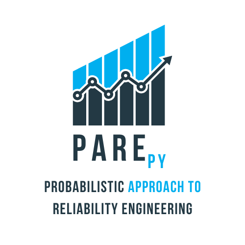

<h1>Estruturas de Concreto Armado 01</h1>

<table>
  <tr>
    <td style="width:70%;">
      

        Olá seja bem vindo a disciplina FEA0063. Neste repositório você encontrará material da disciplina de Estruturas de Concreto Armado 01 minsitrada pelo professor <a target="_blank" rel="noopener" href="http://lattes.cnpq.br/2268506213083114">Wanderlei Malaquias Pereira Junior</a>. A ementa da disciplina é: Histórico. Introdução ao projeto estrutural de edifícios. Forma estrutural e pré-dimensionamento. Deformabilidade do concreto (retração e fluência). Propriedades mecânicas do concreto. Propriedades mecânicas das barras de aço. Comportamento estrutural de elementos fletidos. Estádios de comportamento do concreto. Hipóteses de cálculo na ruína. Flexão normal simples. Aderência e ancoragens das barras de aço. Análise inicial de arranjo das barras de aço em vigas. Projeto de lajes maciças. Projeto de lajes nervuradas.
      

    </td>
    <td style="width:30%;"></td>  
  </tr>
</table>

  Este material é construído com auxílio dos alunos de graduação e pós-graduação que passam pelo curso de Estruturas de Concreto Armado 01. Os alunos são registrado no GitHub da disciplina para que efetivem essa contribuição. Para verificar os alunos que já contribuíram basta consultar o <a target="_blank" rel="noopener" href="https://github.com/wmpjrufg/FEA0063/graphs/contributors"><i>link</i></a>.

<h3>Acesso rápido</h3>

<ul>
  <li><a target="_blank" rel="noopener" href="https://drive.google.com/file/d/1UUOfmCH4539GA46mEw_687d9u7eGKAH4/view?usp=sharing">Prancha padrão</a> em formato <code>.dwg</code></li>
  <li>Programa <a target="_blank" rel="noopener" href="https://smath.com/en-US/view/SMathStudio/download">SMath Studio</a></li>
  <li>Programa <a target="_blank" rel="noopener" href="https://www.ftool.com.br/Ftool/">Ftool</a></li>
</ul>

<h3>Referências</h3>

<ol>
  <li>
ASSOCIAÇÃO BRASILEIRA DE NORMAS TÉCNICAS. NBR 6118: Projeto de estruturas de concreto - Procedimento. Rio de Janeiro, 2023.
</li>
  <li>
ASSOCIAÇÃO BRASILEIRA DE NORMAS TÉCNICAS. NBR 6120: Ações para o cálculo de estruturas de edificações. Rio de Janeiro, 2019.
</li>
</ol>
