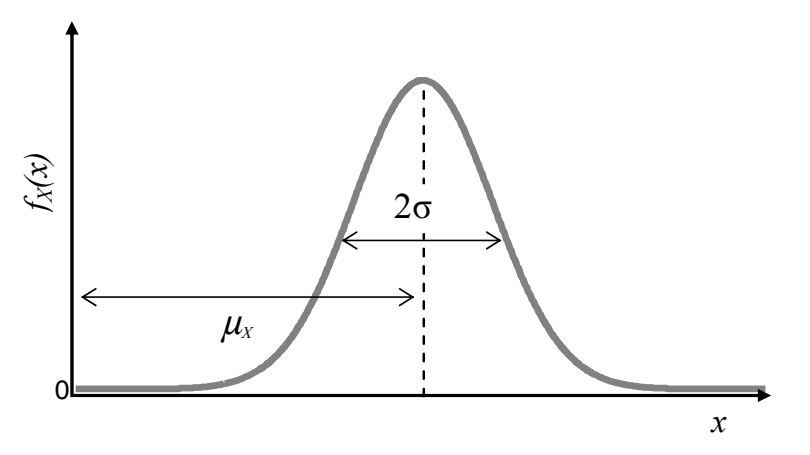
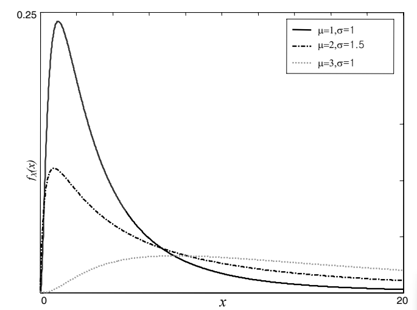
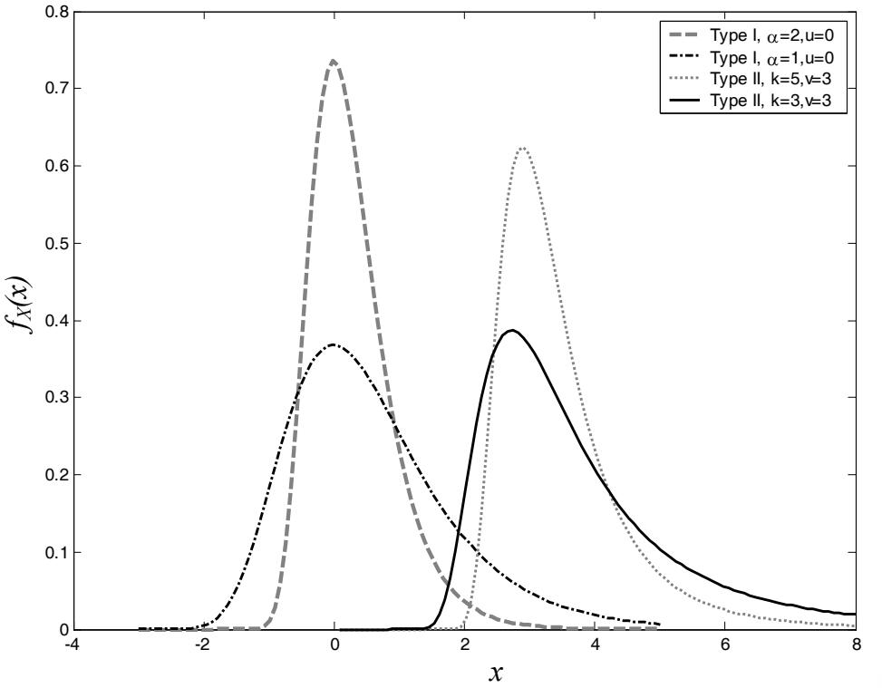
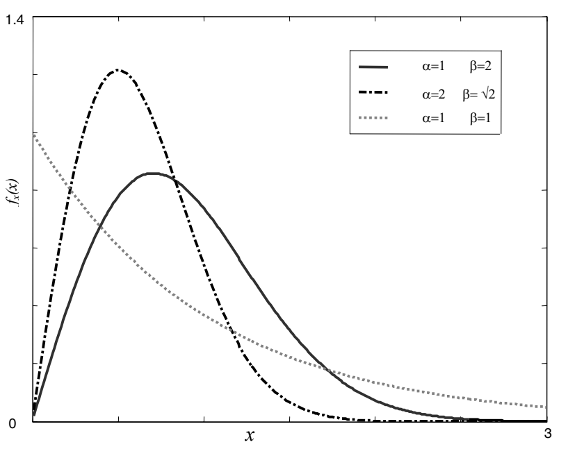

<!--Don't delete this script-->

<!--Don't delete this script-->

Gaussian or Normal
{: .label .label-Blue}

The Gaussian or Normal distribution is by far one of the most important probability distributions in literature, and it is used in many fields of engineering and science due to its simplicity and convenience. This distribution is used to model the Poisson's ratio, among other material properties, for example <a href="#ref1">[1]</a>. It is possible to say that a random variable \(X\) has a Gaussian distribution if its probability density function follows the expression presented in <a href="#eq1">Equation 1</a>.

<table style = "width:100%">
    <tr>
        <td style="width: 90%;">\[ f_{X}(x)=\frac{1}{\sigma\sqrt{2\pi}}\exp\left [ - \frac{1}{2}\left ( \frac{x-\mu}{\sigma} \right ) \right ] \]</td>
        <td style="width: 10%;">
(1)
</td>
    </tr>
</table>

Where the parameters of the distribution \(\mu\) and \(\sigma\) denote the mean and standard deviation of the variable \(X\), respectively, and \(X\) is identified as \(N(\mu,\sigma)\). The location (\(\mu\)) and scale (\(\sigma\)) parameters generate a family of distributions, as a presented in <a href="#fig1">Figure 1</a>.

<b>Figure 1.</b> Normal Density Function.

 

Lognormal
{: .label .label-Blue}

The lognormal distribution (<a href="#fig2">Figure 2</a>) performs an important role for engineering in general, since such function is only defined for positive values and there are a large number of physical phenomena that cannot be negative. This distribution can be applied to describe earthquakes distribution, structural failure due to fatigue, material resistance, the yield strength of steel, among others for instance <a href="#ref2">[2]</a>. 
Suppose a sample of random variable \(X = x_{1},x_{2},x_{3}, ..., x_{n}\) and that the natural logarithms of \(X\) values will be taken, defining a new variable \(Y = \ln{x_{1}},\ln{x_{2}},\ln{x_{3}}, ..., \ln{x_{n}}\). If the variable \(Y\) follows a Normal distribution, then \(X\) is a variable with a lognormal distribution. In other words, if the logarithms of the values of the random variable follow a Normal distribution, then the variable follows a lognormal distribution. 
Thus, it is possible to say that a random variable \(X\) has a lognormal distribution if its probability density function is characterized by <a href="#eq2">Equation 2</a>.

<table style = "width:100%">
    <tr>
        <td style="width: 90%;">\[ f_{X}(x)=\frac{1}{x\sqrt{2\pi}\sigma_{Y}}\exp\left [ - \frac{1}{2}\left ( \frac{\ln{x}-\mu_{Y}}{\sigma_{Y}} \right ) \right ] \]</td>
        <td style="width: 10%;">
(2)
</td>
    </tr>
</table>
 

Where the parameters of the distribution  \(\sigma_{Y}\) and \(\mu_{Y}\) denote the standard deviation and mean of the variable \(Y\), presented in <a href="#eq3">Equation 3</a> and <a href="#eq4">Equation 4</a>, respectively. The parameters of the distribution  \(\sigma_{X}\) and \(\mu_{X}\) denote the standard deviation and mean of the variable \(X\)

<table style = "width:100%">
    <tr>
        <td style="width: 90%;">\[ \sigma_{Y}^{2}=\ln{\left [ \left ( \frac{\sigma_{X}}{\mu_{X}} \right )^{2} +1 \right ]} \]</td>
        <td style="width: 10%;">
(3)
</td>
    </tr>    
    <tr>
        <td style="width: 90%;">\[ \mu_{Y}=\ln{\mu_{X}} - \frac{1}{2}\sigma_{Y}^{2} \]</td>
        <td style="width: 10%;">
(4)
</td>
    </tr>    

</table>
 

<b>Figure 2.</b> Lognormal Density Function.

Extreme Value or Gumbel
{: .label .label-Blue}

The extreme value distribution is used to represent the maximum or minimum of a number of samples of various distributions. There are three types of extreme value distributions, namely Type I, Type II, and Type III <a href="#ref3">[3]</a>. The Type I extreme value distribution, also referred to as the Gumbel distribution, is the distribution of the maximum or minimum of a number of samples of normally distributed data .
 The density function of the Type I extreme value distribution is defined by <a href="#eq5"> Equation 5</a>

<table style = "width:100%">
    <tr>
        <td style="width: 90%;">\[ f_{X}(x)= \alpha \, \exp\left[ -\exp\left( -\alpha(x-u)\right) \right]\, \exp [-\alpha(x-u)] \]</td>
        <td style="width: 10%;">
(5)
</td>
    </tr>
</table>

Where \(\alpha\)  and \(u\) are scale and location parameters, respectively.
  
Similar to the relationship between the Gaussian distribution and lognormal distribution, the Type II extreme value distribution, also referred to as the Frechet distribution, can be derived by using parameters \(u = \ln{v}\), \(\alpha=k\) in the Type I distribution. The Probability Density Function of the Type II extreme value distribution is defined by <a href="#eq6"> Equation 6</a> 

<table style = "width:100%">
    <tr>
        <td style="width: 90%;">\[ f_{X}(x)=\frac{k}{v}\left ( \frac{v}{x}\right )^{k+1} exp\left [ - \left (\frac{v}{k} \right )^{k} \right ] \]</td>
        <td style="width: 10%;">
(6)
</td>
    </tr>
</table>

The density functions of the Type I and Type II extreme value distributions are shown in <a href="#fig3"> Figure 3</a>. The following subsection will discuss the last type of the extreme value distribution, the Type III extreme value distribution, also known as the Weibull distribution.

 

<b>Figure 3.</b> Extrem Value or Gumbel Density Function.

 

Weibull
{: .label .label-Blue}

The Weibull distribution (<a href="#fig4">Figure 4</a>), also referred to as the Type III extreme value distribution, is well suited for describing the weakest link phenomena, or a situation where there are competing flaws contributing to failure. It is often used to describe fatigue, fracture of brittle materials, and strength in composites <a href="#ref4">[4]</a>. The distribution of wind speeds at a given location on Earth can also be described with this distribution.
The probability density function is defined by <a href="#eq7"> Equation 7</a>

<table style = "width:100%">
    <tr>
        <td style="width: 90%;">\[ f_{X}(x)=\frac{\alpha x^{\alpha-1}}\beta^{\alpha}\exp\left [ - \left (\frac{x}{\beta} \right )^{\alpha} \right ] \]</td>
        <td style="width: 10%;">
(7)
</td>
    </tr>
</table>

Every location is characterized by a particular shape and scale parameter. This is a two-parameter family, \(\alpha\) and \(\beta\).

<b>Figure 4.</b> Weilbull Density Function.

<h3>Reference list</h3>

<table>
    <thead>
        <tr>
            <th>ID</th>
            <th>Reference</th>
        </tr>
    </thead>
    <tbody>
        <tr>
            <td>
[1]
</td>
            <td>
<a href="https://doi.org/10.1007/978-1-84628-445-8" target="_blank" rel="noopener noreferrer">Choi, S., Canfield, R.A. & Grandhi, R.V.  (2007). Reliability-based Structural Design. Springer London, 306 pgs.</a>
</td>
        </tr>
    </tbody>
    <tbody>
        <tr>
            <td>
[2]
</td>
            <td>
<a href="https://www.sciencedirect.com/book/9780123820389/e-design" target="_blank" rel="noopener noreferrer">Chang, K. (2016). Chapter 10 - Reliability Analysis.e-Design: Computer-Aided Engineering Design. Revised first edition ed. Amsterdam, Elsevier/Academic Press, 519-589.</a>
</td>
        </tr>
    </tbody>
    <tbody>
        <tr>
            <td>
[3]
</td>
            <td>
<a href="https://doi.org/10.1155/2022/5449751" target="_blank" rel="noopener noreferrer">Abdulali, A. A. A.; Abu Bakar, M. A.; Ibrahim, K.; Mohd Ariff, N.  (2022). Distributions: An Overview of Estimation and Simulation, Journal of Probability and Statistics, p. 1–17.</a>
</td>
        </tr>
    </tbody>
    <tbody>
        <tr>
            <td>
[4]
</td>
            <td>
<a href="https://doi.org/10.3390/ma15113911" target="_blank" rel="noopener noreferrer">Kumar, R.; Madsen, B.; Lilholt, H.; Mikkelsen, L. P. (2022). Influence of Test Specimen Geometry on Probability of Failure of Composites Based on Weibull Weakest Link Theory, Materials, v. 15, n. 11, p. 3911</a>
</td>
        </tr>
    </tbody>
</table>
